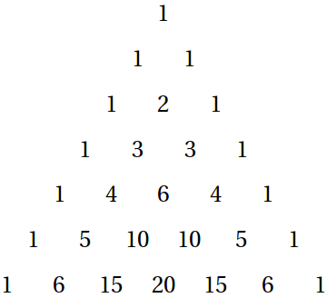

# Introduction

Welcome back!  And more specifically, welcome to the advanced CHS
Coding Club class!

Your attendance in this class was and will be always voluntary.  Feel
like its too hard? No shame; we were all beginners at one point in time.
You can always go back to the beginners class next meeting.  Never give
up!  I want to assess the abilities of you all, so I can determine at
what level I need to be gearing my activities towards this year.  If
you all ace this test, then hooray! We can try and tackle some harder
or more complex things.  If not, that's perfectly fine as well; we'll
stay solid and cover what we need before moving on.

> Throughout the test, I will be providing you with small programs
> that you can use to test to see if your code is working properly
> or not.  They will be in this side pane.  Choose your preferred
> language in the tabs above.

```javascript
// You are currently viewing Javascript code.
```

```python
# You are currently viewing Python code.
```

```java
// You are currently viewing Java code.
```

Again: this test is not as much about me trying to judge you and your
ability to be in this class.  Do not be intimidated by the questions
in this test.  Do not try to cheat, either; you aren't impressing anyone.
I am only doing this to assess the skills of the group as a whole.  If
you try to Google up solutions to the questions, you're only hurting
yourself in the long term, as you will inevitably lost when I assume
you understand material that you actually don't.

This test is an opportunity to put those programming skills you've
learned over the years to work.  Good luck, and have fun!

# Submitting, scoring, etc.

There are several ways you can submit your solutions to me:

1. Through a [repl.it](https://repl.it/) link.  Put each solution in a
  separate file, with the file name matching the one provided in the
  problem specification.
2. Emailing me (bgong4946@colliervilledragons.org) a zip file. Likewise,
  follow the correct file naming format.
3. Emailing/Remind101-ing/texting me a link to a GitHub gist/repo.

I'm not going to tell you specifics about how I will score your
submissions.  But here are some general points to consider:

* I will take a head count of how many people took this pretest.  This
  will be used to determine the average score; <b>if you do not submit, I
  will just put in a score of zero when calculating this average</b>.  I
  will also be looking at score distributions to see how much difference
  there is in programming skills within this class.
* There are tentative point values listed under each question.  You
  may or may not receive all of those points.  This will depend on several
  factors I'm looking at.
* This includes things like do you have the right idea (I give partial
  credit); is your code easy to follow or a jumbled mess of tangled logic;
  did you plagiarize from online (I will be checking! StackOverflow,
  GitHub, several others); etc.
* I will _not_ be looking too much into things like code formatting and
  variable naming.  Single-letter variable names are ok, if you know what
  you're doing. If you confuse yourself by doing this, its your fault.
* Problems towards the end are _much more difficult_ than the first ten
  or so problems.  If you know you can do well, I wouldn't waste my
  time on the first few.
* All submissions will be due by <b>Monday, September 30 at 3:00pm</b>.
  If you make any more edits to your code after that there is no guarantee
  that I will see it.

# Problems

## Starting Out

> For these first few problems, I'm not providing testset generators.
> There's no testsets needed!  Also, for problems where the testset code
> may reveal a key hint about the solution, I will not be providing testsets.
> You'll have to read the problem carefully and reference the examples to
> check your solution.

**1 point**

It's good to have you here! Write a program that outputs _Hello, world!_.

**Specifications:**

* filename: `starting.py`
* inputs: none

<aside class="notice">In the filename, I assume you're using Python.  If not, change the file extension to match whatever language you're using, whether it's <code>.js</code>, <code>.java</code>, <code>.cpp</code>, or another language.</aside>

## On a first-name basis

> Oh, and by the way: the code snippets I provide are a work in progress.
> If you find any errors (which there definitely are), or if you would like to
> contribute a language that you wish was there, let me know!

**2 points**

Ask for the user's name.  Output a personalized greeting that includes
their name.

**Specifications:**

* filename: `customgreeting.py`
* inputs: User input through `stdin`.

## The Lazy Greeter
**3 points**

Some people have really long names (ask Hubert Blaine
Wolfeschlegelsteinhausenbergerdorff Sr., who held the record for the
longest personal name ever used); it's hard to remember all those
letters! Only output a personalized greeting when the name is shorter
than 7 characters, otherwise complain that the name is too lengthy.

**Specifications:**

* filename: `lazygreeting.py`
* inputs: User input through `stdin`.

**Examples:**

* input: `Bob`
* output: `Hello, Bob!`
* explanation: `Bob` is 3 characters long, which is less than 7.
<br><br>
* input: `Alexander`
* output: `Your name is way too long.`
* explanation: `Alexander` is 9 characters long, which is not less than 7.

## Dumb Calculator
**6 points**

Math is really hard, and sometimes we expect too much from our
computers.  Create a low-expectations calculator that adds two numbers
together and outputs the result only if the two numbers are not equal to
each other and their sum is smaller than 20.

**Specifications:**

* filename: `dumbcalc.py`
* inputs: 2 user inputs through `stdin`.

**Examples:**

* input: `2` , `5`
* output: `7`
* explanation: 2+5=7, which is less than 20.
<br><br>
* input: `11`, `10`
* output: `Too hard!`
* explanation: 11+10=21, which is not less than 20.
<br><br>
* input: `9`, `9`
* output: `Not possible`
* explanation: 9=9.

## Multiplier

```javascript
testMultiply = function() {
    for(let i = 0; i < 100; i++) {
        let a = Math.floor(Math.random() * (46341));
        let b = Math.floor(Math.random() * (46341));
        if(multiply(a, b) != a*b) {
            console.log("Submission failed for a=" + a + ", b=" + b);
            return 1;
        }
    }
    console.log("Submission accepted!");
    return 0;
}
```

```python
from random import randint

def testMultiply():
    for x in range(100):
        a = randint(0, 46340)
        b = randint(0, 46340)
        if multiply(a, b) != a*b:
            print("Submission failed for a=", a, ", b=", b)
            return 1
    print("Submission accepted!")
    return 0
```

```java
public class Multiplier {

    public static int multiply(int a, int b) {
        // TODO Implement me!
    }

    public static void main(String[] args) {
        for(int i = 0; i < 100; i++) {
            int a = (int) (Math.random() * 46341);
            int b = (int) (Math.random() * 46341);
            if(multiply(a, b) != a*b) {
                System.out.println("Submission failed for a=" + a + ", b=" + b);
                return;
            }
        }
        System.out.println("Submission accepted!");
        return;
    }
}
```

**4 points; 8 points if extra challenge is completed**

Functions are reusable pieces of code, like tools in a toolbox that you can use
in different ways for whatever you need.  Write a function that returns the
product of two integers. Extra challenge: can you do this without using the
* operator?

**Specifications:**

* filename: `multiplier.py`
* function signature: `multiply(a: Int, b: Int) -> Int`
* constraints: `a`,`b` ∈ ℤ; |`a`| <= 46340; |`b`| <= 46340.

**Examples:**

* call: `multiply(13, 16)`
* returns: `208`
* explanation: 13*16=208.
<br><br>
* input: `multiply(3, 14159)`
* returns: `42477`
* explanation: 3*14159=42477.

## Temperature translator

```javascript
// you can use the below two functions in any way you want
function getRandomTemp() {
    return Math.random() * 300 - 150;
}
function getRandomUnit() {
    return (Math.random() > 0.5) ? "fahrenheit" : "celsius";
}

// just a suggestion
testTranslate = function() {
    for(let i = 0; i < 100; i++) {
        let temp = getRandomTemp();
        let unit = getRandomUnit();
        console.log(temp + ", " + unit + ", " + convertTemp(temp, unit));
    }
}
```

```python
import random

# you can use the below two functions in any way you want
def getRandomTemp():
    return random.uniform(-150, 150)
def getRandomTemp():
    return "fahrenheit" if random.choice([True, False]) else "celsius"

# just a suggestion
def testTranslate():
    for i in range(100):
        temp = getRandomTemp()
        unit = getRandomUnit()
        print(temp, ",", unit, ",", convertTemp(temp, unit))
```

```java
public class TempConvert {

    // you can use the below two functions in any way you want
    private static double getRandomTemp() {
        return Math.random() * 300 - 150;
    }
    private static String getRandomUnit() {
        return (Math.random() > 0.5) ? "fahrenheit" : "celsius";
    }

    public static double convertTemp(double from, String toUnit) {
        // TODO Implement me!
    }

    // just a suggestion
    public static void main(String[] args) {
        for(let i = 0; i < 100; i++) {
            double temp = getRandomTemp();
            String unit = getRandomUnit();
            System.out.println(temp + ", " + unit + ", "
                + convertTemp(temp, unit));
        }
    }
}
```

**6 points**

Bumpy (living in America) loves to talk on the phone to his best buddy, Lumpy
(living in England) about the weather.  However, since neither of them are
particularly bright, each can't understand how the other's temperature scale
works.  When they go to Google Translate, they are unable to find either
Fahrenheit or Celsius as a language to convert to.  Help Bumpy and Lumpy by
writing a function that can convert between Celsius and Fahrenheit.

**Specifications:**

* filename: `tempconvert.py`
* function signature: `convertTemp(x: Float, toUnit: String) -> Float`

**Examples:**

* call: `convertTemp(0, "fahrenheit")`
* returns: `32`
* explanation: 0 is assumed to be Celsius, since you want to convert to
  Fahrenheit; 0°C = 32°F.
<br><br>
* call: `convertTemp(67.21, "celsius")`
* return: `19.561111`
* explanation: 0 is assumed to be Fahrenheit, since you want to convert to
  Celsius; 67.21°F = 19.561111°C.

<aside class="success">Don't worry too much about matching the exact decimal
values of your program up with my examples - all languages handle floating
point differently! As long as it's close enough, you're good.</aside>

## 99 Bottles of Beer

> There's no real way for me to provide you with much for this one,
> but I can give you the lyrics so you don't have to go look them up.

```
99 bottles of beer on the wall, 99 bottles of beer.
Take one down and pass it around, 98 bottles of beer on the wall.

98 bottles of beer on the wall, 98 bottles of beer.
Take one down and pass it around, 97 bottles of beer on the wall.

...

2 bottles of beer on the wall, 2 bottles of beer.
Take one down and pass it around, 1 bottle of beer on the wall.

1 bottle of beer on the wall, 1 bottle of beer.
Take one down and pass it around, no more bottles of beer on the wall.

No more bottles of beer on the wall, no more bottles of beer.
Go to the store and buy some more, 99 bottles of beer on the wall.
```

**8 points**

99 Bottles of beer on the wall, 99 bottles of beer.  take one down and pass it
around, 98 bottles of beer on the wall. Output all of the lyrics to this song.  
<aside class="warning">Ensure that there is subject-verb agreement throughout
the song! Make sure your grammar is correct.</aside>

**Specifications:**

* filename: `bottlesofbeer.py`
* input: none

## MishMash
**8 points**

Dish and Dash are playing a game where they take turns and say a number,
counting up from 1.  But, there's some special rules that make this game more
difficult.  If the number is divisible by 7, they have to say "Mish".  If it's
divisible by 13, they have to say "Mash".  Finally, if it's divisible by both,
they have to say "MishMash".  Write a program that outputs the first 1,000
turns of this game.

**Specifications:**

* filename: `mishmash.py`
* input: none

## Collatz Conjecture

```javascript
// Just a little convenience so you don't have to worry about it :)
function randInt() {
    return Math.floor(Math.random() * 1000000 + 1);
}
```

```python
import random

# Just a little convenience so you don't have to worry about it :)
def randInt():
    return random.randint(1, 1000000)
```

```java
class Collatz {

    // Just a little convenience so you don't have to worry about it :)
    private static int randInt() {
        return (int) (Math.random() * 1000000 + 1);
    }
}
```

**8 points**

Wikipedia states that "The Collatz conjecture is a conjecture in mathematics
that concerns a sequence defined as follows: start with any positive integer n.
Then each term is obtained from the previous term as follows: if the previous
term is even, the next term is one half the previous term. If the previous term
is odd, the next term is 3 times the previous term plus 1. The conjecture is
that no matter what value of n, the sequence will always reach 1."  For an
integer n, print out each step until it arrives at 1.

**Specifications:**

* filename: `collatz.py`
* input: `x` ∈ Z; 0 < `x` < Integer.maxVal

**Examples:**

* input: `7`
* output: `7 22 11 34 17 52 26 13 40 20 10 5 16 8 4 2 1`
* explanation: The sequence proceeds as according to the Collatz conjecture.
<br><br>
* input: `23`
* output: `23 70 35 106 53 160 80 40 20 10 5 16 8 4 2 1`
* explanation: The sequence proceeds as according to the Collatz conjecture.

## Forgetful Echo
**14 points**

In Greek mythology, Echo was a nymph who repeated everything that was said to
her.  Unfortunately, recently she has become a little bit forgetful, and is
only able to repeat half of what is said to her.  Given a sentence, output
half of the sentence (in terms of word count, not characters).  If the sentence
is an odd number of words long, round up.

**Specifications:**

* filename: `echo.py`
* input: String containing only alphabetic characters and single spaces.

**Examples:**

* input: `To be or not to be that is the question`
* output: `To be or not to`
* explanation: The sentence is 10 words long; Echo only remembers 5 of them.
<br><br>
* input: `Talk is cheap show me the code`
* output: `Talk is cheap show`
* explanation: The sentence is 7 words long; Echo only remembers 4 of them.

## Pythagorean Theorem

```javascript
testPythagorean = function() {
    for(let i = 0; i < 100; i++) {
        let a = Math.random() * 200;
        let b = Math.random() * 200;
        if(abs(pythagorean(a, b) - Math.hypot(a, b)) > 0.0001) {
            console.log("Submission failed for a=" + a + ", b=" + b);
            return 1;
        }
    }
    console.log("Submission accepted!");
    return 0;
}
```

```python
from random import uniform
from math import hypot

def testPythagorean():
    for x in range(100):
        a = uniform(0, 200)
        b = uniform(0, 200)
        if abs(pythagorean(a, b) - math.hypot(a, b)) > 0.0001:
            print("Submission failed for a=", a, ", b=", b)
            return 1
    print("Submission accepted!")
    return 0
```

```java
public class Pythagorean {

    public static double pythagorean(double a, double b) {
        // TODO Implement me!
    }

    public static void main(String[] args) {
        for(int i = 0; i < 100; i++) {
            double a = Math.random() * 200;
            double b = Math.random() * 200;
            if(abs(pythagorean(a, b) - Math.hypot(a, b)) > 0.0001) {
                System.out.println("Submission failed for a=" + a + ", b=" + b);
                return;
            }
        }
        System.out.println("Submission accepted!");
        return;
    }
}
```

**8 points; 16 points if extra challenge is completed**

The Pythagorean Theorem states that in any Euclidean right triangle, the square
of the length of the hypotenuse, or the side opposite the right angle, is equal
to the sum of the squares of the other two legs.  Implement the Pythagorean
Theorem.  You may not use any built in `stdlib` functions except `pow()` and
`sqrt()`.
Bonus: Can you implement the Pythagorean Theorem without using _any_
`stdlib` functions?

**Specifications:**

* filename: `pythagorean.py`
* function signature: `pythagorean(a: Float, b: Float) -> Float`

**Examples:**

* call: `pythagorean(3, 4)`
* returns: `5.0`
* explanation: 3-4-5 is the famous Pythagorean triple;
 $\sqrt{3^2+4^2}=\sqrt{25}=5.$
<br><br>
* call: `pythagorean(2.5416, 1.84658)`
* return: `3.141590084`

## Mix n' Match
**10 points**

Catherine the caterpillar has a hard time figuring out what to wear every day.
She has two outfits, which are sets of shirts for each segment of her body.
Today, she wants to combine two outfits, by alternating one shirt from each
outfit.  Write a function that takes two lists, representing shirts, and
combines them into one, taking one item from each list alternately.

**Specifications:**

* filename: `mixnmatch.py`
*  signature: `mix(a: [Any], b: [Any]) -> [Any]`

**Examples:**

* call: `mix([1, 2, 3] , ['a', 'b', 'c'])`
* returns: `[1, 'a', 2, 'b', 3, 'c']`
* explanation: Take the first element from list A, then the first from list B,
  then the second from list A, then the second from list B, and so on.
<br><br>
* call: `mix(["hello"] , ["there"])`
* returns: `["hello", "there"]`
* explanation: Take the first element from list A, then the first from list B,
  then the second from list A, then the second from list B, and so on.

## ATOI

```javascript
testATOI = function() {
    for(let i = 0; i < 100; i++) {
        let a = Math.floor(Math.random() * 2147483647 - 1073741823);
        if(atoi(a.toString()) != a) {
            console.log("Submission failed for a=" + a);
            return 1;
        }
    }
    console.log("Submission accepted!");
    return 0;
}
```

```python
from random import randint

def testATOI():
    for x in range(100):
        a = randint(-1073741824, 1073741823)
        if atoi(str(a)) != a:
            print("Submission failed for a=", a)
            return 1
    print("Submission accepted!")
    return 0
```

```java
public class ATOI {

    public static int atoi(String x) {
        // TODO Implement me!
    }

    public static void main(String[] args) {
        for(int i = 0; i < 100; i++) {
            double a = Math.floor(Math.random() * 2147483647 - 1073741823);
            if(atoi(a.toString()) != a) {
                System.out.println("Submission failed for a=" + a);
                return;
            }
        }
        System.out.println("Submission accepted!");
        return;
    }
}
```

**16 points**

The C standard library defines a function, `atoi()` (ascii-to-integer), that
converts a string containing a number to an integer data type.  Implement ATOI
without using any stdlib functions besides string operations.  Make sure you
account for negatives.  Any use of built-in or stdlib functions for converting
from strings to numerical data type will disqualify credit for this question.

**Specifications:**

* filename: `atoi.py`
* function signature: `atoi(x: String) -> Int`

**Examples:**

* call: `atoi("1776")`
* returns: `1776`
* explanation: The string containing "1776" is converted to the actual number,
  1776.
<br><br>
* call: `atoi("-0000271828")`
* returns: `-271828`
* explanation: Leading zeros do not affect the value of a number, but a negative
  sign does.

## Enthusiastic Math
**14 points; 24 points if extra challenge is completed**

In mathematics, especially in the fields of counting and combinatorics, the !
operator - denoting a factorial - is used extensively.  The factorial is defined
as the product of all of the natural numbers below a certain integer.  For
example, `5! = 5*4*3*2*1`.  Zero is a special case; `0! = 1`.  Implement a
function that calculates the factorial of a certain number.  Bonus points if you
can show this both recursively and iteratively.

**Specifications:**

* filename: `factorial.py`
* function signature: `factorial(x: Int) -> Int` where `0 <= x <= 12`.

**Examples:**

* call: `factorial(0)`
* returns: `1`
* explanation: `0! == 1`.
<br><br>
* call: `factorial(4)`
* returns: `24`
* explanation: `4! = 4*3*2*1 = 24`.

<aside class="success">If you've come this far, congratulations! I am very impressed by your skill. Consider the rest of this test not an assessment but rather a chance to show off even more of your skills.  And if you can't do the problems below, that's okay! These are meant to be difficult.  Some of these problems are extraordinarily hard, especially if you haven't undergone formal training.</aside>

## Recamán's Sequence
**12 points**

The sequence depicted in the logo of the On-line Encyclopedia of Integer
Sequences (OEIS) is Recamán's sequence, which can be succinctly described as
"If you can't go backward, go forward."  Starting at 0, you try to subtract
increasingly larger integers; if you cannot (terms must be non-negative), or
the number has been used before, you add instead.  The first 16 terms of the
sequence are given below.

<p>
$$0, 1, 3, 6, 2, 7, 13, 20, 12, 21, 11, 22, 10, 23, 9, 24$$
</p>

Write a function that generates the first n terms of Recamán's sequence.

**Specifications:**

* filename: `recaman.py`
* function signature: `recaman(n: Int) -> [Int]`, with `n >= 1`.

**Examples:**

* call: `recaman(1)`
* returns: `[0]`
* explanation: Return only the first value of Recamán's sequence.
<br><br>
* call: `recaman(4)`
* returns: `[0,1,3,6]`
* explanation: First element is zero; add one, add two, and then add three
  (since you can't subtact in any of those cases).

## Pascal Rows
**20 points**

In Pascal's triangle, each row of numbers is one item longer than the previous,
with each item in each row being the sum of the two numbers above it.  The first
7 rows of Pascal's triangle are given below.<br>
<div style="margin-left: 15%;">
</img></div>

```javascript
// print out the first ten rows of Pascal's triangle
testPascal = function() {
    let result = "";
    for(let i = 0; i < 10; i++) {
        let rowArr = pascalRow(i);
        for(let j = 0; j < rowArr.length; j++) {
            result += rowArr[j] + " ";
        }
        result += "\n";
    }
    console.log(result);
}
```

```python
# print out the first ten rows of Pascal's triangle
def testPascal():
    result = ""
    for i in range(10):
        rowArr = pascalRow(i)
        for j in rowArr:
            result += j + " "
        result += "\n"
    print(result)
```

```java
public class Pascal {

    public static int[] pascalRow(int idx) {
        // TODO Implement me!
    }

    public static void main(String[] args) {
        String result = "";
        for(int i = 0; i < 10; i++) {
            int[] rowArr = pascalRow(i);
            for(int j = 0; j < rowArr.length; j++) {
                result += rowArr[j] + " ";
            }
            result += "\n";
        }
        System.out.println(result);
    }
}
```

Rows are zero-indexed, meaning the first row (with just one element, 1) has
index zero.  Your challenge is to find the row that corresponds to the given
index.  There are many ways to do this, some being too
computationally-intensive, some being too space-intensive.  Can you find an
efficient way to do this?

**Specifications:**

* filename: `pascal.py`
* function signature: `pascalRow(idx: Int) -> [Int]` where `0 <= idx <= 33`.

**Examples:**

* call: `pascalRow(0)`
* returns: `[1]`
* explanation: This is the zeroth row of Pascal's triangle, by definition.
<br><br>
* call: `pascalRow(4)`
* returns: `[1,4,6,4,1]`
* explanation: This is the fourth row of Pascal's triangle.

## Luggage Packing
**24 points**

Pogo is packing for his vacation in Wyoming.  He wants to put the heaviest items
at the bottom of his suitcase so it does not fall over easily.  Being very
meticulous, Pogo has weighed all of the items in his suitcase and recorded all
of the data.  Given a list of weight measurements, sort the weight measurements
in non-decreasing order.

**Specifications:**

* filename: `luggage.py`
* function signature: `sortWeights(weights: [Int]) -> [Int]`

**Examples:**

* call: `sortWeights([5,6,4,7,2,3])`
* returns: `[2,3,4,5,6,7]`
* explanation: No new elements are added to the set, and no elements are
  deleted; they are simply rearranged in non-decreasing order.
<br><br>
* call: `sortWeights([0,0,1,0,1,4748527])`
* returns: `[0,0,0,1,1,4748527]`
* explanation: The elements are returned sorted from least to greatest.

## Riemann Sum
**24 points; 30 points if extra challenge is completed**
There are many ways to approximate the area between a curve and the x-axis.
One common method is to use a Riemann Sum, which splits up the area into very
tiny rectangles.  The general form of a Left Riemann Sum is given as such:

The area under the curve $f(x)$ with bounds $a$ and $b$ is given by

<p>$$A=\lim_{n\to\infty}{\sum^n_{i=1}f(x_i)\Delta x},$$</p>

where $\Delta x = \frac{b-a}{n}$.  Note that the higher n is, the more accurate
the area estimation will be, because there will be more small rectangle
subdivisions.  Your challenge will be to implement a Riemann sum calculator.

Use code to approximate the area under the function

<p>$$f(x)=\frac{x^4(1-x)^4}{1+x^2}$$</p>

from $0$ to $1$.  Then, multiply the value by $-1$, and
add $\frac{22}{7}$.  Print the final result.  Extra challenge: can you
generalize the Riemann sum function to take any function as a parameter
(lambda or first-class) and return the Riemann sum with arbitrary precision?

**Specifications:**

* filename: `riemann.py`
* input: none
* (extra challenge) function signature: `riemann(f: Function, from: Float, to: Float, subintervals: Int) -> Float`

## Mirror, Mirror, on the Wall
**24 points**

Gerald has a Strange Mirror which, instead of flipping images horizontally and
reflecting them back, flips images across a diagonal line from the top-left
corner down and to the right such that `NxM` images become `MxN`.  For example,
this image:

<p>
$$
\begin{bmatrix}
    2 & 6 & -3 \\
    7 & -5 & 1
\end{bmatrix}
$$
</p>

is transposed to:

<p>
$$
\begin{bmatrix}
    2 & 7 \\
    6 & -5 \\
    -3 & 1
\end{bmatrix}.
$$
</p>

Create a function that, given an input image, returns what will be reflected by
Gerald's Strange Mirror.

**Specifications:**

* filename: `mirror.py`
* function signature: `transpose(input: [[Int]]) -> [[Int]]`

## Roman Numerals
**36 points**

A bombshell study released by a group of world-renown archaeologists has
revealed that contrary to popular belief, Caesar was not stabbed to death by
Brutus and the Senate; instead, in a freak physics phenomenon, he was sucked
through a wormhole and teleported to present times.  Caesar is appalled by the
number system used here.  Implement a function that converts from decimal
numbering to roman numerals to better help him understand his new life as a
Walmart cashier.

**Specifications:**

* filename: `romannumerals.py`
* function signature: `toRomanNumerals(num: Int) -> String`

**Examples:**

* call: `toRomanNumerals(14)`
* returns: `"XIV"`
* explanation: This is a string with the Roman numeral representation of `14`.
<br><br>
* call: `toRomanNumerals(2019)`
* returns: `"MMXIX"`
* explanation: This is a string with the Roman numeral representation of `2019`.

## No Plagiarism, Please
**40 points**

Mr. Kopikat, unable to understand why his excessively boring assignments have
made his students uninterested and unmotivated, has recently been having
problems with students in his English class copying work from online instead of
writing it themselves.  Help him write a plagiarism checker function that,
given a short phrase, checks whether or not it is contained in a larger body
phrase.  You may only use `charAt()` functions if your language provides it; you
may not use built-in substring or regex functions.

**Specifications:**

* filename: `kopikat.py`
* function signature: `checkPlagiarism(query: String, body: String) -> Boolean`

**Examples:**

* call: `checkPlagiarism("is", "A single death is a tragedy; a million deaths is
  a statistic.")`
* returns: `true`
* explanation: The query string, "is", is found in the body string.  The student
  must have plagiarized!
<br><br>
* call: `checkPlagiarism("walrus", "It is better to be feared than loved, if you
  cannot be both.")`
* returns: `false`
* explanation: The query string, "walrus", is not found anywhere in the body
  string.  A trustworthy student.

## Prophetic Warren Buffett
**54 points**

Warren Buffett, making a deal with a treacherous genie, wished to have the
ability to foresee stock prices. While technically granting the wish, the genie
gave him so much data that he is now overloaded with hundreds of numbers and
does not know how to comprehend all of it. Can you help him outsmart the genie
by writing a function that automatically sifts through the data and determines
the maximum profit possible from buying and selling stocks optimally?

**Specifications:**

* filename: `stockprofit.py`
* function signature: `findProfit(prices: [Float]) -> Float`

**Examples:**

* call: `findProfit([14.09, 11.66, 14.01, 15.38, 12.42])`
* returns: `2.96`
* explanation: The most optimal time to buy is when the stock is worth \$15.38;
  the most optimal time to sell is when it is worth \$12.42; thus your profit is
  \$15.38 - \$12.42 = \$2.96.
<br><br>
* call: `findProfit([19.68, 19.23, 19.05, 15.0, 13.13, 12.67, 12.57, 11.45])`
* returns: `0`
* explanation: There is no time to buy and then sell such that you can make a
  profit.  Better to not buy at all!

## Weird Plots of Land
**78 points**

As a rough first day on the job, Nodnarb, a novice surveyor, was asked to survey
a weirdly-shaped plot of land and find the area of it.  Unsure what to do,
Nodnarb flew his drone up such that it was directly above the parcel of land,
showing that the land was in the shape of an irregular, convex polygon.  He
recorded the coordinates of the vertices of the land plot in meters in a
counterclockwise fashion.  Write a function that, from this list of coordinates,
determines the area of the land.

**Specifications:**

* filename: `weirdland.py`
* function signature: `findArea(coordinates: [(Int,Int)]) -> Float`

## Iconic Skylines
**64 points**

Huge, famous cities around the world are recognizable just by their skylines:
New York, Seattle, London, Shanghai, and most notably the city of Aaaaak.
However, recently Aaaaak has been facing population problems as people flock to
the city for the countless opportunities that it offers.  How many stories can
Aaaaak build up without changing its world-famous skyline viewed from any angle
(front, right, left, back)?  Assume in Aaaaak buildings are perfectly square,
and every story is the same height.  The current heights (in stories) of all the
skyscrapers is reported in a 2d array of integers.  Return the maximum number of
stories that Aaaaak can build to solve its population problem.

**Specifications:**

* filename: `skylines.py`
* function signature: `getMaxStories(cityMap: [[Int]]) -> Int`

## Big Number Builder
**84 points**

Given a list of integers, find the largest number possible created by the
concatenation of those numbers.  Brute-search methods, e.g. generating every
possible number from the list and finding the maximum by comparing those
numbers, will not be accepted.  There is a more elegant way to do it that is
much more efficient than $O(n!)$ time.

**Specifications:**

* filename: `numberbuilder.py`
* function signature: `buildBigNumber(from: [Int]) -> Int`

**Examples:**

* call: `buildBigNumber([32, 16, 85, 7])`
* returns: `85473216`
* explanation: Using all numbers, the largest number possible is 85,473,216.
<br><br>
* call: `buildBigNumber([1, 641, 16, 8])`
* returns: `8641161`
* explanation: Using all numbers, the largest number possible is 8,641,161.

## Bored Monkeys
**96 points**

You have $N$ monkeys at $N$ different stations doing different activities
(eating bananas, getting massages, swinging around in trees, etc), with only one
monkey at a station at a time.  After a while, all of the monkeys get bored with
their station and want to switch somewhere else.  In how many ways can you
rearrange the monkeys such that no monkey is at its original station?

**Specifications:**

* filename: `monkey.py`
* function signature: `getPermutations(n: Int) -> Int`

**Examples:**

* call: `getPermutations(4)`
* returns: `9`
* explanation: With 4 monkeys and 4 stations, there are 9 ways to rearrange them
  such that none are in their original spot; if we name the monkeys Deborah,
  Pam, Susan, and Karen (with their order indicating which station they begin),
  we can reorder them as such:
    * Karen, Susan, Deborah, Pam
    * Pam, Deborah, Karen, Susan
    * Pam, Karen, Deborah, Susan
    * Karen, Deborah, Pam, Susan
    * Pam, Susan, Karen, Deborah
    * Susan, Karen, Deborah, Pam
    * Karen, Susan, Pam, Deborah
    * Susan, Karen, Pam, Deborah
    * Susan, Deborah, Karen, Pam
<br><br>
* call: `getPermutations(12)`
* returns: `176214841`
* explanation: With 12 monkeys in 12 stations, there are 176,214,841 ways to
  rearrange them.

## It's Complex
**100 points for all functionality implemented**

Complex numbers, an extension of the real number system, can be represented in a
two-dimensional plane with a real component and an imaginary component $i$,
where $i\cdot i=-1$.  Implement complex numbers and basic operations.  If you
implement raising complex numbers to arbitrary powers, i.e. $(a+bi)^n$, I will
reward bonus points.

**Specifications:**

* filename: `complex.py`
* class constructor: `Complex(realpart: Float, complexpart: Float)`
* required functionality: Adding, subtracting, multiplying, dividing,
  conjugate, magnitude.  *optional: exponentiating*

## Listless Lists
**120 points for all functionality implemented**

Implement a list data type without using any built-in arrays, lists, or `stdlib`
collections.  You must also implement creating, pretty-printing, getting, and
setting to receive full credit.  If you are using python or another
dynamically-typed language, your list must support any type.  Additional
algorithms, such as sorting, will earn extra points.

**Specifications:**

* filename: `mylist.py`
* class constructor: `MyList(), MyList(length: Int), MyList(from: [Object])`
* required functionality: Creating, printing, getting, setting.  *optional:
  sorting, searching, copying, reversing, etc.*

## Gradual Edits
**150 points**

Given a list of similar-looking words, ex. ["pig", "pic", "tic", "dog", "pog"]
determine if there is a way to, starting at one word, arrive at another word by
only moving between one-word modifications.  For example, from "dog" to "tic",
there is a way: "dog" -> "pog" -> "pig" -> "pic" -> "tic".  If so, return that
path as an array.  If not, return null.

**Specifications:**

* filename: `edits.py`
* function signature:
  `gradualEdit(wordlist: [String], fromIdx: Int, toIdx: Int) -> [String]`

**Examples:**

* call: `gradualEdit(["pig", "pic", "tic", "dog", "pog"], 3, 2)`
* returns: `["dog", "pog", "pig", "pic", "tic"]`
* explanation: You want to go from "dog" to "tic"; there is a path that exists,
  editing one letter at a time.  Return that path in an array.
<br><br>
* call: `gradualEdit(["pig", "pic", "tic", "dog"], 3, 2)`
* returns: `null`
* explanation: You want to go from "dog" to "tic"; however, there is no path
  that you can take in which you only edit one letter at a time.  So, return
  `null`.

## Puddles
**180 points**

Puddles form in ruts and holes in the ground.  But how much water can a surface
hold?  Given a 2d matrix of ground elevation for a square of land in inches,
calculate the maximum amount of rain the piece of land can hold.  Remember,
water will flow off of the sides; do not imagine the sides of the model as able
to hold water as well.

**Specifications:**

* filename: `puddles.py`
* function signature: `puddles(map: [[Int]]) -> Int`
